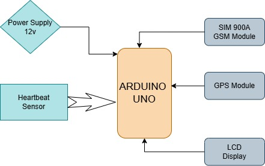
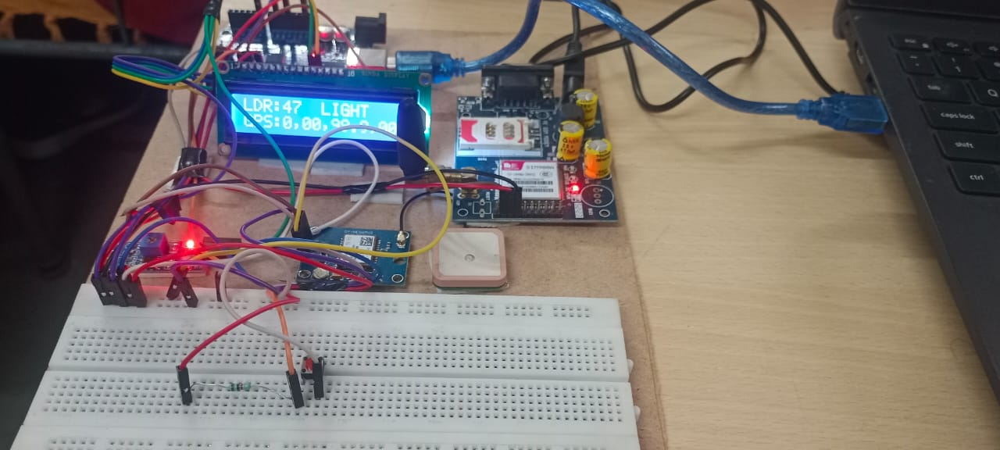
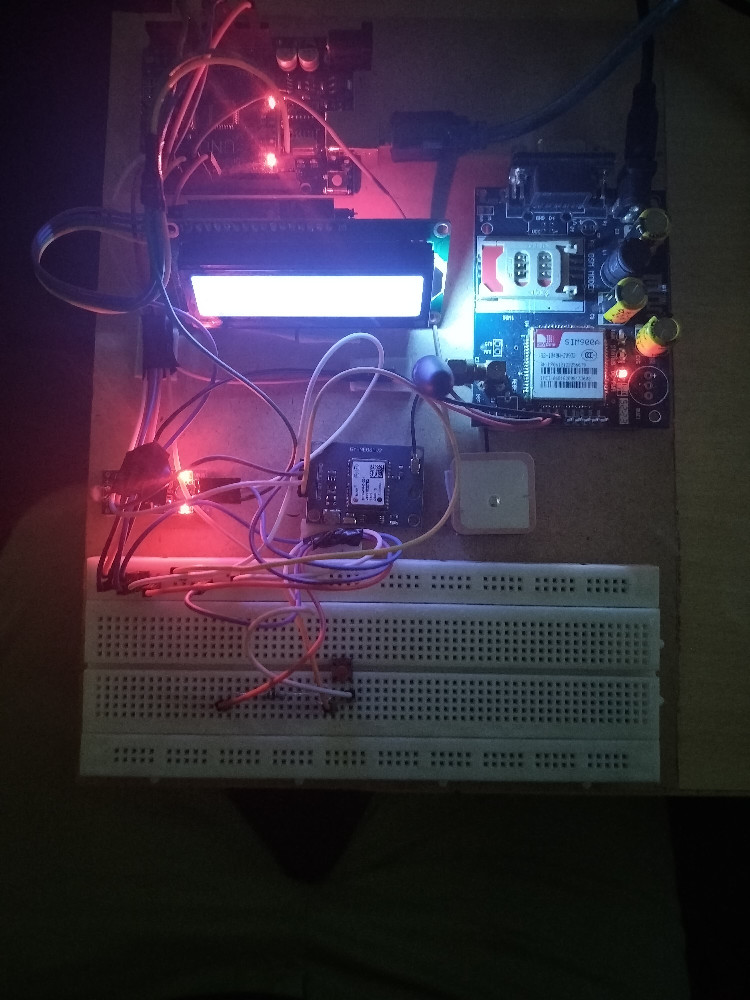
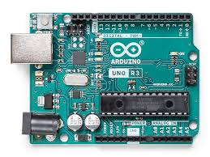
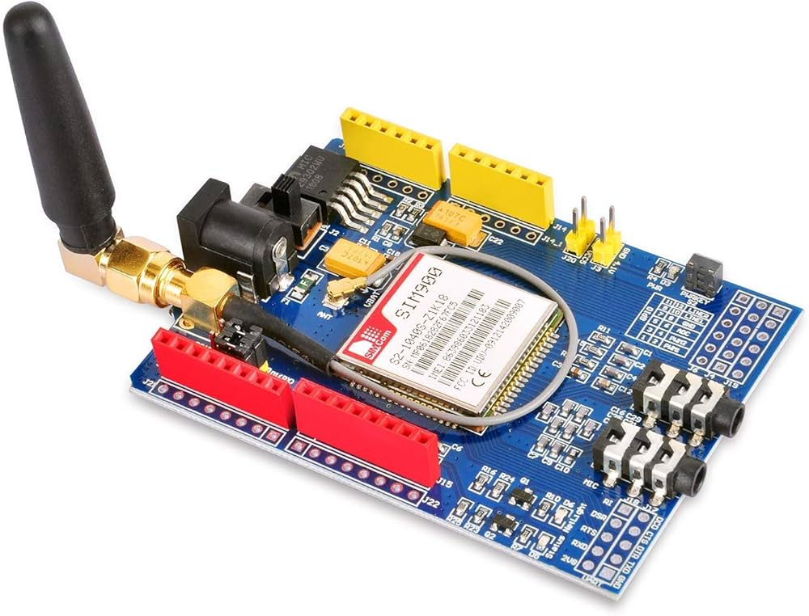
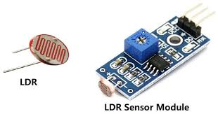
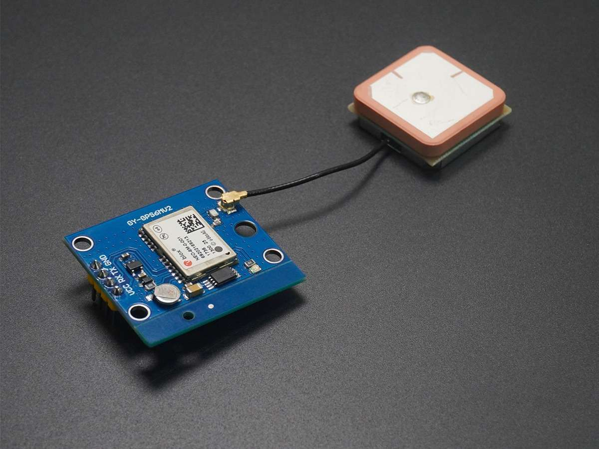
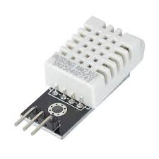
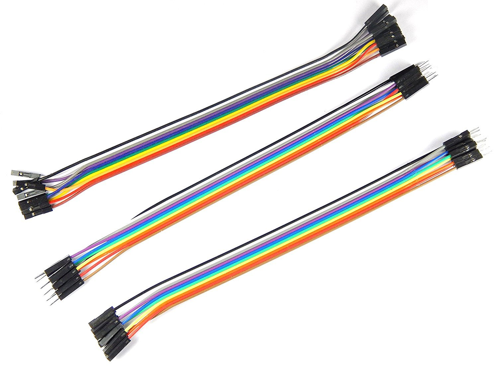

# Soldier Tracking and Health Monitoring System
**An Arduino-based solution for real-time soldier health and environmental monitoring with GPS tracking and GSM alerts**




## Table of Contents
- [Project Images](#Images)
- [Features](#features)
- [Hardware Components](#hardware-components)
- [Installation](#installation)

## Project Images





## Features
- **Health Monitoring**
  - Pulse rate detection (via analog sensor)
  - Body temperature monitoring (DHT11)
- **Environmental Sensing**
  - Light intensity detection (LDR)
  - Ambient humidity measurement
- **Position Tracking**
  - Real-time GPS coordinates (NMEA parsing)
  - SMS alerts with Google Maps link
- **Alert System**
  - Manual distress button (Digital PIN 6)
  - Automatic darkness detection
  - Periodic status updates (30s intervals)

## Hardware Components

  
**Arduino UNO R3** - The central microcontroller that processes sensor data, manages communications, and coordinates all system components. Acts as the brain of the tracking system.

  
**SIM900A GSM Module** - Enables cellular communication for sending SMS alerts and status updates. Handles distress signals and environmental warnings through mobile networks.

  
**LDR (Light Dependent Resistor)** - Detects ambient light levels to identify low-light/dark environments. Triggers alerts when soldiers enter unlit or concealed areas.

  
**NEO-6M GPS Module** - Provides real-time geolocation data using satellite signals. Updates coordinates every 5 seconds for accurate position tracking.

  
**DHT22 Sensor** - Measures both air temperature (°C) and relative humidity (%). Monitors environmental conditions affecting soldier health and equipment performance.

  
**Jumper Wires** - Create secure connections between components. Color-coded (red=5V, black=GND, yellow=signals) for easy circuit assembly.

  
**Breadboard** - Temporary prototyping platform for testing and connecting electronic components without soldering. Enables modular system configuration.

| Component              | Specification           | Connection        |
|------------------------|-------------------------|-------------------|
| Arduino Uno R3         | ATmega328P              | Base Controller  |
| SIM900A GSM Module     | Quad-band 850/900/1800/1900MHz | TX=7, RX=8 |
| NEO-6M GPS Module      | 5Hz update rate         | TX=4, RX=5       |
| DHT11 Sensor           | Temperature & Humidity  | Digital PIN 3    |
| LDR Sensor             | 10kΩ Dark Resistance    | Analog A0        |
| I2C LCD Display        | 16x2, Address 0x27     | SDA=A4, SCL=A5   |
| Push Button            | Tactile Switch          | Digital PIN 6    |

## Installation
1. **Software Requirements**
   - Arduino IDE 2.3.2+
   - Required Libraries:
     ```bash
     LiquidCrystal_I2C (v1.1.4)
     DHT Sensor Library (v1.4.4)
     SoftwareSerial (Built-in)
     ```

2. **Hardware Setup**
   ```arduino
   [Power Connections]
   GSM Module → 12V 2A External Supply
   Arduino → 7-12V DC
   All GND → Common Ground
   ```
